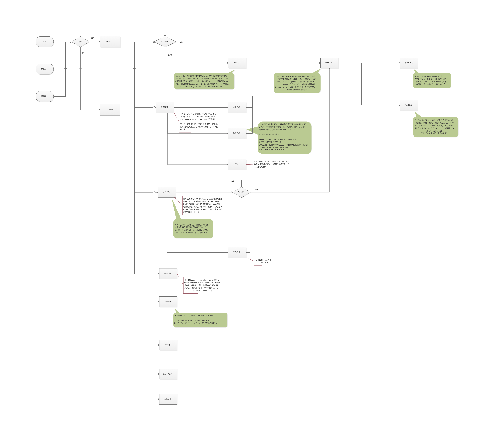

Google 支付
==================

一、相关文档和连接
--------------
[支付相关](https://developer.android.com/google/play/billing/billing_overview)
 
[订阅相关](https://developer.android.com/google/play/billing/billing_subscriptions)
 
[Demo相关](https://github.com/android/play-billing-samples)
 
 [其它1](https://developer.android.com/google/play/billing/billing_testing)
 [其它2](https://developer.android.com/google/play/billing/developer-payload)
 

 
二、一次性商品和订阅商品处理流程图
 --------------

三、概念
--------------
  https://developer.android.com/google/play/billing
  
 1.需要了解一次性商品（受管理商品）；奖励产品；订阅商品

 2.非消耗型商品：无限期使用的一次性商品；消耗型商品：不能无限期使用的一次性商品
 
 3.非消耗型一次性商品；消耗型一次性商品
 
     
四、客户端根据深度链接跳转到 Google Play 商店
 --------------
 客户端根据深度链接跳转到Google Play 商店
 
 public static final String PLAY_STORE_SUBSCRIPTION_URL= "https://play.google.com/store/account/subscriptions";
 
 public static final String PLAY_STORE_SUBSCRIPTION_DEEPLINK_URL= "https://play.google.com/store/account/subscriptions?sku=%s&package=%s";
 
 String url;
 if (sku == null) {
     // If the SKU is not specified, just open the Google Play subscriptions URL.
     url = Constants.PLAY_STORE_SUBSCRIPTION_URL;
 } else {
     // If the SKU is specified, open the deeplink for this SKU on Google Play.
     url = String.format(Constants.PLAY_STORE_SUBSCRIPTION_DEEPLINK_URL,sku, getApplicationContext().getPackageName());
 }
 Intent intent = new Intent(Intent.ACTION_VIEW);
 intent.setData(Uri.parse(url));
 startActivity(intent);
 
 
四、后端服务器根据实时开发者通知的订阅状态改变透传给客户端的Push消息协议）
  --------------
  1.推送处理方法（较优做法）：理论上长链接服务器 -> 谷歌推送 能使消息到达，最及时知道用户订阅状态的改变
  
    Socket Server---------->Google FCM
          |         失败       |        
          |成功                | 成功
          |                   |     
          |-------------------| 
                    |
                    |
                    |
                    ↓
              App Client 前台应用弹出Dialog / 后台应用弹出Noticifiation; 上报已处理该消息
                    
          
  2.拉取处理方法：用户进入应用后也应该向我们的后台拉取订阅的最新状态，需要添加两个接口：
    2.1 Http拉取最新订阅状态的接口
    2.2 Http上报已处理最新状态的接口
  
  
主要状态需要通知用户:
 
1.用户处于宽限期 SUBSCRIPTION_IN_GRACE_PERIOD
根据您在Google Play控制台中的应用内商品设置，宽限期会持续一段时间。
Google Play尝试在宽限期内续订订阅。要提醒用户付款问题，请在您的应用中提供一条消息，告知用户如何解决其付款方式。否则，用户将无法访问订阅。
例如，“为防止您的帐户中断，请导航至Google Play订阅设置以将付款固定在Google Play上。” 该消息将链接到Google Play订阅设置，以便用户可以更改其付款方式。

{
  "cmd": "3001",
  "ver": "1",
  "data": {
    "sku":"subs.sixmonths",
    "title": "订阅异常（宽限期）",
    "content": "To prevent disruptions to your account, navigate to the Google Play subscription settings to fix your payment on Google Play.",
    "negative": "取消",
    "negativeLink": "",
    "positive": "确定",
    "positiveLink": "https://play.google.com/store/account/subscriptions?sku={sku}}&package={packageName}",
    "prompt": "不再提示",
    "promptLink": "https://play.google.com/store/account/subscriptions?sku={sku}}&package={packageName}"
  }
}
注意更改其中的sku和package参数

2.帐户保留- SUBSCRIPTION_ON_HOLD
帐户保留期为30天。在帐户暂停期间，您应该检查用户的订阅是否已取消，恢复或重新购买。
在帐户暂停期间，通知您的用户为何订阅的访问被暂停。为了通知用户，请在您的应用中向消息提供有关如何解决其付款方式并重新获得对订阅的访问权限的说明。
例如，“您的订阅存在问题。导航到Google Play订阅设置，以将您的付款固定在Google Play上。” 该消息将链接到Google Play订阅设置，以便他们可以更改其付款方式。

{
  "cmd": "3002",
  "ver": "1",
  "data": {
    "sku":"subs.sixmonths",
    "title": "订阅异常（帐户保留期间）",
    "content": "There is a problem with your subscription. Navigate to the Google Play subscription settings to fix your payment on Google Play.",
    "negative": "取消",
    "negativeLink": "",
    "positive": "确定",
    "positiveLink": "https://play.google.com/store/account/subscriptions?sku={sku}}&package={packageName}"
  }
}
注意更改其中的sku和package参数

3.暂停订阅 SUBSCRIPTION_PAUSED
订阅暂停仅在当前计费期结束后才生效。订阅暂停时，用户无权访问订阅。在暂停期结束时，订阅将恢复，并且Google尝试续订。
如果恢复成功，则订阅将再次变为活动状态。如果由于付款问题导致简历失败，则用户进入帐户保留状态 .

暂停订阅后，我们建议您告诉用户在应用程序中时，由于他们已暂停订阅，因此无权访问。您还应该提供一种方法，使用户可以使用指向Google Play的深层链接来手动恢复订阅

{
  "cmd": "3003",
  "ver": "1",
  "data": {
    "sku":"subs.sixmonths",
    "title": "暂停订阅",
    "content": "You don't have access to the subscription because You have paused it. Navigate to the Google Play subscription settings if you want to resume the subsiption now",
    "negative": "取消",
    "negativeLink": "",
    "positive": "确定",
    "positiveLink": "https://play.google.com/store/account/subscriptions?sku={sku}}&package={packageName}"  
  }
}
注意更改其中的sku和package参数

4.取消订阅 SUBSCRIPTION_CANCELLED
用户可以从Play商店中自动取消订阅，或者在保留后仍无法恢复的情况下自动取消订阅。

在您的应用中显示一条消息，通知用户其订阅已取消，例如“您的订阅将在** some_date **到期。
导航到Google Play订阅设置以恢复您的订阅。” 此消息应链接到Google Play订阅设置，以便用户可以续订他们的订阅。

{
  "cmd": "3004",
  "ver": "1",
  "data": {
    "sku":"subs.sixmonths",
    "title": "取消订阅",
    "content": "Your subscription will expire on {**some_date**}. Navigate to the Google Play subscription settings to restore your subscription.",
    "negative": "取消",
    "negativeLink": "",
    "positive": "确定",
    "positiveLink": "https://play.google.com/store/account/subscriptions?sku={sku}}&package={packageName}" 
  }
}
注意更改其中的sku和package,{**some_date**}参数

5.订阅已恢复 Subscription recovered - SUBSCRIPTION_RECOVERED
您记录了更新的付款方式，并且您的订阅已恢复。

{
  "cmd": "3005",
  "ver": "1",
  "data": {
    "sku":"subs.sixmonths",
    "title": "恢复订阅",
    "content": "Your updated form of payment was recorded and your subscription has been recovered.",
    "Negative": "取消",
    "negativeLink": "",
    "Positive": "确定",
    "PositiveLink": ""
  }
}

6.价格变动
    您至少有7天的时间与您的现有订阅者联系，以了解价格变化，然后Google Play才能开始通知他们。
    1.引导用户
    2.同意后感谢用户
{
  "cmd": "3006",
  "ver": "1",
  "data": {
    "sku":"subs.sixmonths",
    "title": "Agree to price change ? ",
    "content": "Your subscription will change from $60 / month to $100 /month on Jun 2 ,2020. To continue your subscription at the new price , tap Agree.
    Click on the link for more information https://play.google.com/store/account/subscriptions?sku={sku}}&package={packageName}",
    "Negative": "cancel ",
    "negativeLink": "",
    "Positive": "Agree",
    "PositiveLink": ""
  }
}
注意更改其中的sku和package参数

7.重新订阅(取消订阅->重新订阅)

您应该显示适当的UI以便重新订阅：H5 ？

如果用户没有有效的订阅，则该应用将具有“购买”按钮。
如果用户取消了订阅（SUBSCRIPTION_CANCELLED），则该应用可能具有“重新订阅”按钮。有关更多信息，请参见 处理SUBSCRIPTION_CANCELLED。

8.升级降级

提供升降级UI ？
